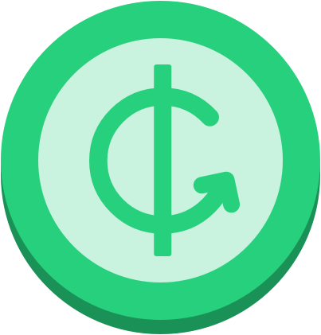

<p align="center">
  <a href="https://github.com/adrian-apetrei/IGive" target="blank"></a>
</p>

## Description

IGive application was build with [Ionic](https://ionicframework.com/) framework integrated with [Angular](https://angular.io/) and [Finastra's Design System](https://github.com/fusionfabric/finastra-design-system)

<p align="left">
  <a href="https://ionicframework.com/" target="blank"></a>
  <a href="https://angular.io/" target="blank"></a>
</p>

## Installation

```bash
npm install
```

Set `apiUrl` in `src/environment.ts`

## Running the app

Install the Ionic CLI with npm:

```bash
npm install -g @ionic/cli
```

Run application

```bash
# development
$ ionic serve -l
```

For running the application on android or ios you can find the detailed guides here:
1 [Android](https://ionicframework.com/docs/developing/android#running-with-capacitor)
2 [IOS](https://ionicframework.com/docs/developing/ios)
