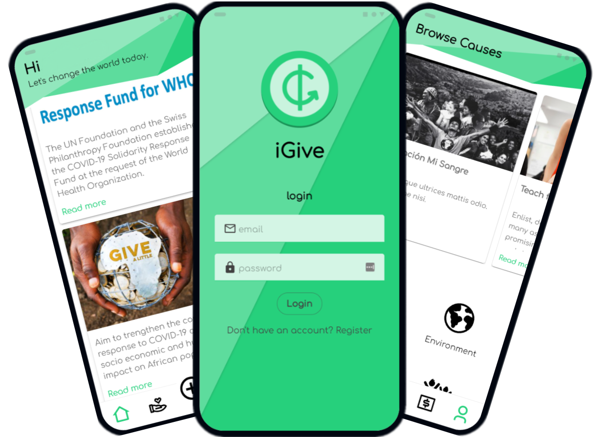

# IGive

<p align="center">


</p>
<p align="center">
Hack to the Future 2020 - IGive

## Description

IGive is a alternative to the regular donation systems that allows users to choose different charities/projects to donate based on their topics preference

## Features

- Use PSD2 to connect to your bank account without paying extra transaction fees

- Three Donation Methods: <br>
  Round Up: App will round up to the nearest dollar on every purchase made using your bank card and donate that money to the cause. <br>
  Incognito: App will take a set amount time you perform an action, with limits you can control, eg take 25c every time you use your card <br>
  Determined: Carefully select how much you want to donate to which charities, eg donate $25 each month.

- Manage all the past and recurring donations, view by charities or by transactions

- In-app notification for donation updates

- Option to download Donation Certificate for further tax return purpose

## Installation

1 Clone this repository

```bash
 git clone https://github.com/adrian-apetrei/IGive.git
```

2 Follow the installation instructions found in the readme file of these folders:

IGive-backend <br>
IGive-ui

## Links

[IGive on DEVPOST](https://devpost.com/software/igive) <br>
[Hack to the Future 2020](https://fintech.devpost.com/)
